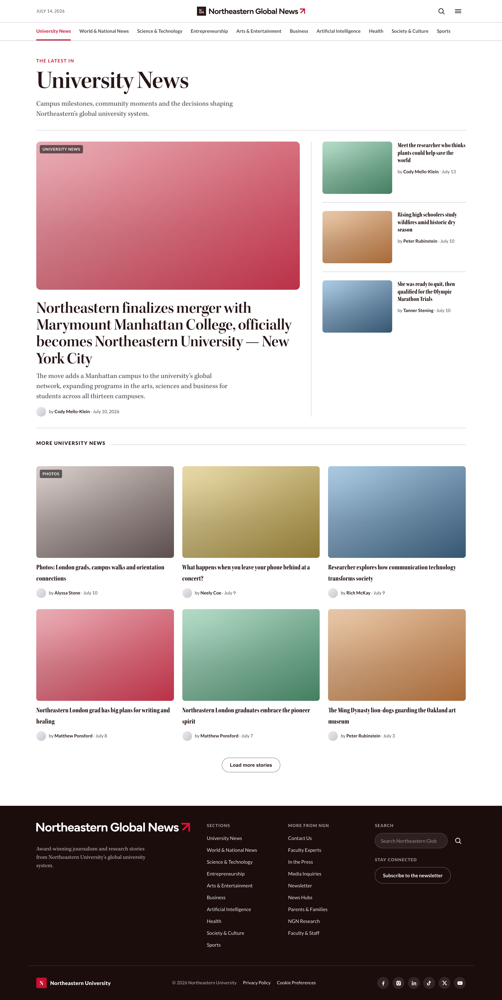
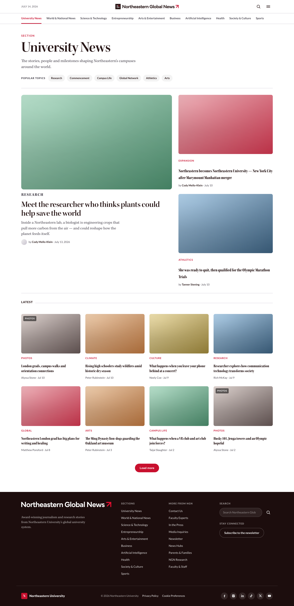
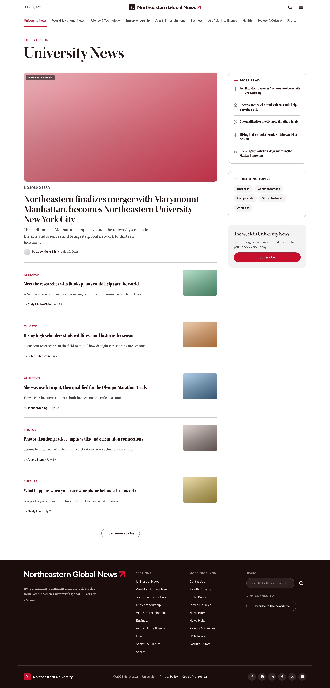

# Phase 1: First Concepts (July 14, 2026)

**Live preview (public, opens in any browser, no login):**

https://thara-messeroux.github.io/ngn-category-landing-prototypes/phase-1-concepts/

Status: frozen. The opening set of ideas, shared with the team to start the feedback conversation. It uses placeholder images with the real design system tokens. Use the pill at the bottom of the page to switch between the three versions.

| Version | Concept | Reference |
| --- | --- | --- |
| A. The Lead | A dominant lead story with a ruled sidebar and a three-up river | NYT, Washington Post |
| B. Magazine Grid | A featured band over a card grid, with topic chips | Business Insider |
| C. Reading List | A prioritized feed with a Most Read rail and a newsletter sign-up | The Athletic, TIME |

## Previews

### A. The Lead

### B. Magazine Grid

### C. Reading List

## How to view

Live preview (opens in a browser): [Live preview](https://claude.ai/code/artifact/2e2b272c-e653-4137-b25e-842fc698241f).

Full-size screenshots: [A. The Lead](phase-1-first-concepts-a-the-lead-desktop-2026-07-14.png), [B. Magazine Grid](phase-1-first-concepts-b-magazine-grid-desktop-2026-07-14.png), [C. Reading List](phase-1-first-concepts-c-reading-list-desktop-2026-07-14.png).

Interactive version: serve the parent folder and open `phase-1-concepts/index.html`. This version needs the folder structure kept intact for `../shared/ngn-shell.js`, and a connection for the Typekit fonts.

This set went through the team's Pastel review. The 27 comments from 7 reviewers shaped Phase 2.
