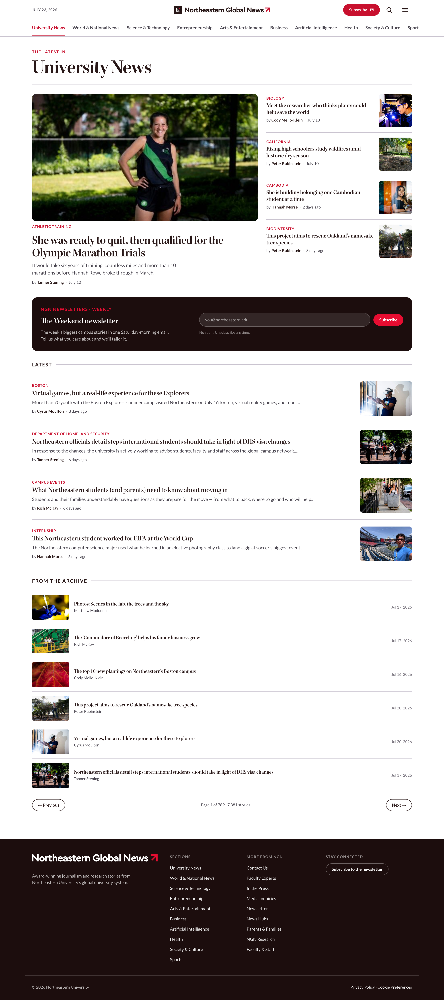
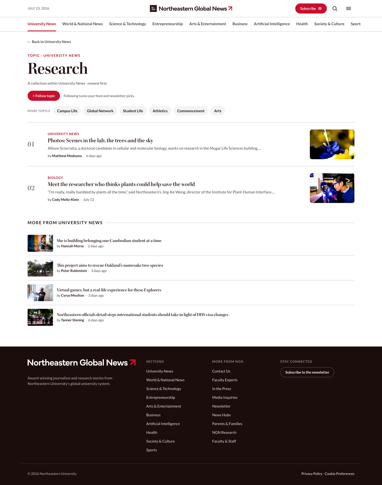
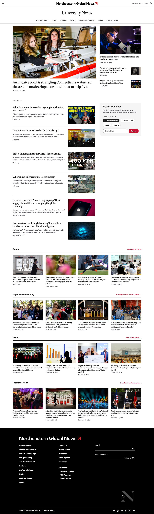

# Phase 2: Live Data (July 21 to 22, 2026)

**Live preview (public, opens in any browser, no login):**

https://thara-messeroux.github.io/ngn-category-landing-prototypes/phase-2-live-data/

Status: frozen. Four directions rebuilt from the team's 27 Pastel comments and the hand sketches, this time with real stories, photos, bylines, and archive counts pulled from the live site. The fonts are embedded, so the page renders the same anywhere, including offline.

| Option | Idea | Reference |
| --- | --- | --- |
| 1. Section front | The editor's page: lead package, numbered topics, weekly feed | NYT |
| 2. The briefing | The scanner's page: featured band, newsletter block, paginated archive | Business Insider |
| 3. The reader | The browser's page: large images, sticky topic chips, Most Read rail | TIME reading flow |
| 4. The magazine | Stacked topic modules with a large hero | TIME architecture |

Also working: section switching across four categories, clickable topic pages, and a paginated archive. Use the pill switcher at the bottom, click a section in the nav, or click any topic.

## Previews

### 1. Section front

### 2. The briefing

### 3. The reader

### 4. The magazine

### Subtopic page (example: Research)
Clicking a topic opens an in-page collection of stories for that topic.

## Zach's design

Kept in this folder for easy reference. This is Zach's own composite exploration (08-composite-v3), a separate track from the four options above. It later became the base for Phase 3.

## How to view

Live preview (opens in a browser): [Live preview](https://claude.ai/code/artifact/8c115f85-1cd6-4748-89f2-5bac57e920c1).

Full-size screenshots: [1. Section front](phase-2-live-data-1-section-front-desktop-2026-07-21.png), [2. The briefing](phase-2-live-data-2-the-briefing-desktop-2026-07-21.png), [3. The reader](phase-2-live-data-3-the-reader-desktop-2026-07-21.png), [4. The magazine](phase-2-live-data-4-the-magazine-desktop-2026-07-21.png), [Subtopic page](phase-2-live-data-subtopic-research-desktop-2026-07-21.png), [Zach, 08-composite-v3](zach-08-composite-v3-desktop-2026-07-22.png).

Interactive version: download `index.html` and open it in a browser. It is self-contained and needs no server or connection.

Note: this is a prototype. Stories were captured at build time, the forms and Load More are not wired up, and the newsletter names and cadences are placeholders to confirm.
