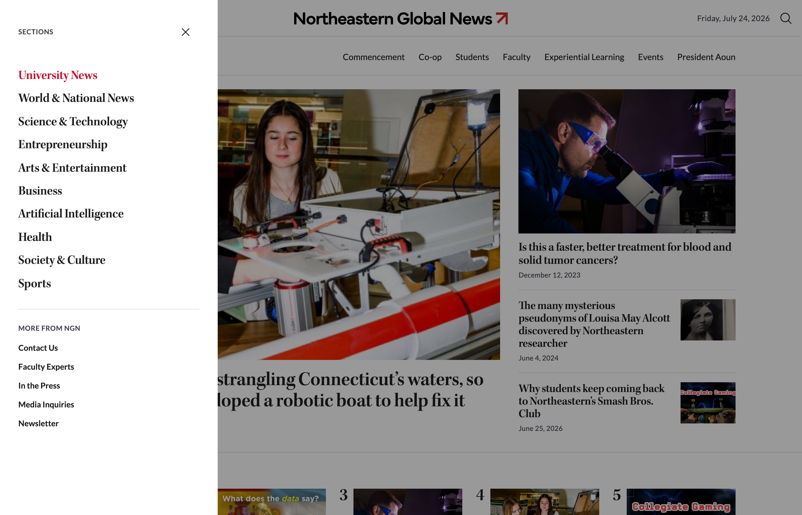
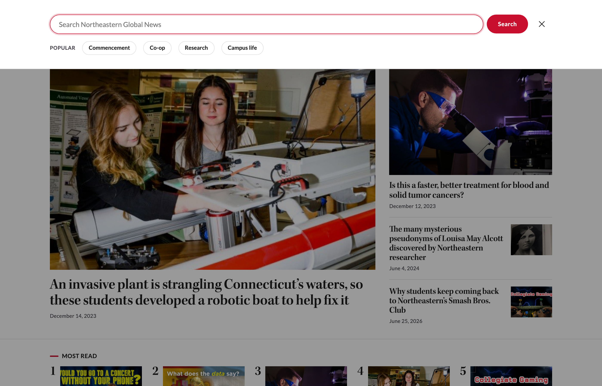

# Phase 4: Mobile Refinement

Status: active. Started as an exact copy of phase-3-synthesis, the version presented and approved on July 23, 2026. Phase 3 stays untouched. All new work happens here.

Target: the presentation on Monday, July 27, 2026.

## Built on July 24, 2026

### Main objective
- [x] Full mobile experience pass. Each part designed and tested at real phone width (375px): header and nav, hero, Most Read, cards and archive grid, newsletter, footer.

### Decided in the July 23 review
- [x] Adopted the sticky header pattern: one sticky bar with the page title on the left and the topics on the right (the cat-bar from Zach's 10-composite-v5.html). On phones the title sits on its own line with a swipeable topic row below it, and a soft fade hints that more topics are there.

### Refinements requested (July 23 discussion)
- [x] Newsletter: the Daily and the Weekend are now one option, labeled with its schedule (Monday to Saturday).
- [x] Newsletter: Faculty and Staff removed from the public chooser. It is a restricted list and should not be open for anyone to sign up.
- [x] Most Read: moved up and made far more prominent. It is now a full-width horizontal strip directly below the hand-picked featured stories, so it reads high on the page without pushing the lead story down. On phones the five stories become a swipeable row.
- [x] Most Read: each story now shows a photo with a large serif rank number in the same ink as the headlines.

### Refinements from the July 24 review pass
- [x] A Seen around campus photo module now sits under the sticky newsletter, so the right column stays full while the reader scrolls the Latest list.
- [x] Topic pages: the small red Topic kicker is gone. The page already says where you are three other ways.
- [x] The section title in the sticky bar is larger and now works as a link back to the landing view from any topic page.
- [x] Every see-more link (More stories, See all stories, All photos) shares one uppercase style.
- [x] The hamburger menu now opens a preview of the site-wide sections menu, with the current section highlighted.
- [x] The search icon opens a working search bar with popular topic shortcuts. Submitting runs a real search on the live site. Both the menu and the search fit and work at phone width.

### From the July 24 design audit
- [x] Every section title (The Latest, Most Read, the newsletter, Seen around campus, and each topic group) is now a real heading, so the page reads as a clean outline for screen readers. No visible change.
- [x] The newsletter now leads with the benefit ("Get Northeastern's top stories in your inbox") instead of only the mechanic.
- [x] Verified contrast passes WCAG AA: muted text 9.34 to 1, red links 5.88 to 1.

## Previews

### Zach's header pattern, now adopted (10-composite-v5.html)
The sticky bar with the title on the left and the topics on the right, built by Zach. Phase 4 uses this pattern as decided in the July 23 review.

### Landing page, desktop

### Landing page, mobile

### Subtopic page, desktop (example: Co-op)

### Subtopic page, mobile (example: Co-op)

### Site menu open, desktop

### Search open, desktop

## How to view

Live preview (opens in a browser): [Live preview](https://claude.ai/code/artifact/9a299877-4ab2-4ee0-bf5e-91a4da8f654b).

Full-size screenshots: [Landing desktop](phase-4-mobile-refinement-desktop-2026-07-24.png), [Landing mobile](phase-4-mobile-refinement-mobile-2026-07-24.png), [Subtopic desktop](phase-4-mobile-refinement-subtopic-co-op-desktop-2026-07-24.png), [Subtopic mobile](phase-4-mobile-refinement-subtopic-co-op-mobile-2026-07-24.png), [Site menu open](phase-4-mobile-refinement-site-menu-desktop-2026-07-24.png), [Search open](phase-4-mobile-refinement-search-desktop-2026-07-24.png), [Zach's header pattern](../screenshots/10-composite-v5-desktop.png).

Interactive version: download `index.html` and open it in a browser. It is self-contained and needs no server.
